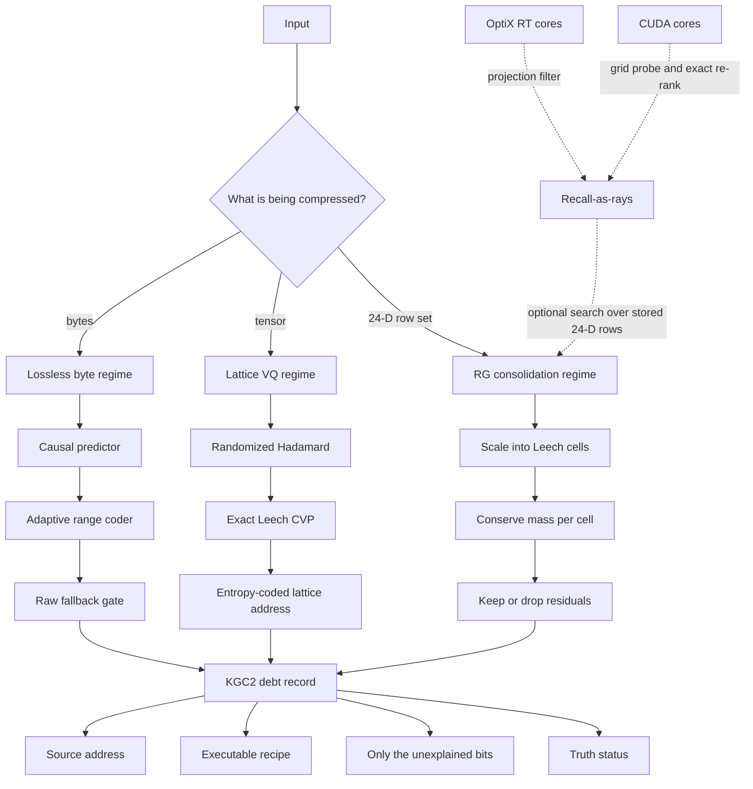

# KGC — Kaleidoscope Geometric Codec

> **A real lattice codec for bytes, tensors, and memory consolidation.**
> *Compress the model of the thing, then pay precisely for what the model misses.*

[](#quick-start)
[](#the-kgc2-debt-record)
[](#1-bytes--lossless)
[](#2-tensors--lattice-vq)
[](#recall-as-rays)

KGC is the second-generation codec in this repository. It is built around a very simple promise:

\[
\boxed{L(x) = L(\text{address}) + L(\text{program}) + L(\text{residual})}
\]

That is the **Law of Compression Debt**. An archive says where its source came from, which deterministic recipe generated its prediction, and the entropy-coded remainder that the recipe could not explain. No mystical free bits. No geometric metadata smuggled beside a backup copy of the original. The decoder can inspect the debt before it reconstructs anything.

<p align="center">
  <a href="docs/KGC_SYSTEM_MAP.mmd">Open the standalone Mermaid system map</a> ·
  <a href="ARCHITECTURE.md">Read the engineering architecture</a> ·
  <a href="docs/KGC_ICEBERG.md">Descend into the KGC iceberg</a>
</p>

---

## The shape of the system



The larger diagram lives in [`docs/KGC_SYSTEM_MAP.mmd`](docs/KGC_SYSTEM_MAP.mmd). It is deliberately a source file, not a screenshot: change the system, change the map, review the change.

| Regime | What it accepts | Core move | What it guarantees |
|---|---|---|---|
| **BYTES** | Any byte string | Deterministic causal prediction plus adaptive range coding | Exact recovery; SHA-256 verified; raw fallback prevents pointless expansion |
| **TENSOR** | Weights or embeddings | Randomized Hadamard or dense-rotation transform, exact Leech nearest-point quantization, entropy coding | Auditable lossy reconstruction with an explicit rate–distortion dial. On real weights (all-MiniLM-L6-v2): 23.85 dB @ 4.34 bits/weight |
| **PROGRESSIVE** | Weights or embeddings | Per-block gain/shape split, exact Leech CVP of the direction, truncatable residual layers | Decode at any fidelity from a byte-exact truncation point — see [§2b](#2b-progressive--truncatable-decode) for the honest rate-distortion trade-off |
| **CONSOLIDATE** | Sets of 24-D rows | Renormalization-style collapse to canonical Leech sites | Conserved group mass; optional bitwise-exact residuals; addressable lossy mode |

---

## The KGC2 debt record

Every KGC2 archive is a small argument about reconstruction:

\[
\text{archive} = \underbrace{H(x)}_{\text{address}} + \underbrace{P}_{\text{program}} + \underbrace{r}_{\text{residual}}
\]

- **Address** — a SHA-256 identity for the source material. Lossy modes require this anchor.
- **Program** — deterministic parameters, seeds, lattice choices, and predictor registry names. The program is a recipe, not a hidden copy of the source.
- **Residual** — the information the program failed to predict, encoded with a range coder.

The decoder reports a truth rung rather than letting every output pretend to be equally literal:

| Truth status | Meaning |
|---|---|
| `exact_recovery` | The original bytes or exact residual-bearing values were recovered and verified. |
| `reconstruction` | A declared lossy decoder produced a numeric approximation. |
| `interpretation` | A downstream rendering or summary is derived from the reconstruction. |
| `confabulation` | A claim has exceeded what the archive can support. It is named, not silently upgraded to fact. |

This distinction is not decorative. It is the boundary that lets a geometric system remain technically honest.

The address/program/truth control block itself is Golay-protected: up to three flipped bits anywhere in the archive's version, regime, truth, or flags fields are healed transparently on decode; four or more are detected and rejected rather than silently misparsed as a different regime.

---

## 1. BYTES — lossless

For bytes, KGC is a deterministic predictor front-end feeding an adaptive range coder:

\[
L(x_{1:n}) \approx \sum_{t=1}^{n} -\log_2 p(x_t \mid x_{<t})
\]

Better next-byte probabilities mean fewer coded bits. The important constraint is replay: the decoder must regenerate **exactly** the same probability distribution at every byte, with no learned weights hidden in the archive.

```text
bytes → predictor → byte-probability distribution → range coder → KGC2
                                      ↓
                            if it does not shrink
                                      ↓
                                raw KGC2 payload
```

### Predictor sockets

| Mode | What it is | Archive payload |
|---|---|---|
| `geometric` | Dependency-free adaptive context model | Coded payload or raw fallback |
| `predictor:ngram-mix` | Deterministic mixed n-gram predictor | Predictor name plus coded payload |
| `predictor:gru-online` | Fixed-seed GRU trained identically during encode and decode | Predictor name plus coded payload; no model weights |
| `predictor:llama-qwen` | Qwen 2.5 1.5B GGUF socket through `llama-cpp-python` | Predictor name plus coded payload if it wins |

The Qwen socket is real, and its byte-distribution mapping is exact. It is not advertised as a compression win yet: on the currently exercised short-text fixture the container correctly chose the raw fallback rather than pretend a larger archive was success. That is good codec behavior. A predictor earns its place when it beats the fallback on a defined workload, not when it merely produces plausible text.

### Lossless use

```python
from e8zip import KGCCompressor

kgc = KGCCompressor()
source = b"the residual is the part of reality the model did not catch"

archive = kgc.compress(source)
restored, info = kgc.decompress(archive)

assert restored == source
assert info["truth_status"] == "exact_recovery"
```

`kgc.inspect(archive)` reads the debt record — address, program metadata, conserved mass — without decoding the payload.

For a deterministic predictor:

```python
archive = kgc.compress(source, mode="predictor:gru-online")
restored, info = kgc.decompress(archive)
assert restored == source
```

**Honest boundary:** this byte codec is not a replacement for LZ-family codecs on match-heavy data. KGC's contribution here is a verified debt container and replayable probabilistic front-end. Compare it against zlib, zstd, or your production baseline on your own corpus.

---

## 2. TENSORS — lattice VQ

Tensor compression is the place where the geometric machinery is doing real work. A tensor is decorrelated, normalized, split into 24-dimensional blocks, and quantized to the nearest point in the Leech lattice \(\Lambda_{24}\).

\[
W \xrightarrow{\mathrm{RHT}} y \xrightarrow{/\sigma}\frac{y}{\sigma}\cdot s
\xrightarrow{\operatorname{CVP}_{\Lambda_{24}}} \hat y
\xrightarrow{\mathrm{RHT}^{-1}} \hat W
\]

Where \(s\) is the rate–distortion knob: larger \(s\) allocates more distinguishable lattice cells and generally yields higher fidelity at a higher bit rate.

### Why the Leech lattice?

The Leech lattice is a 24-dimensional even unimodular lattice with extraordinary packing structure. KGC uses an exact Conway–Sloane / Golay-code nearest-point decoder rather than a heuristic nearest-neighbour search. Each 24-D block becomes an efficiently coded lattice address:

\[
\text{Leech point} \longleftrightarrow (g_{\mathrm{idx}},\ \mathrm{case},\ z)
\]

The Golay-derived structure also gives an error-correcting relation over stored indices: `LeechCodec.heal_index` can repair up to three flipped bits in a codeword index.

### Rate–distortion, not vibes

Lossy compression has to be reported as a pair:

\[
R = \frac{\text{coded bits}}{\text{original weights}},
\qquad
\operatorname{SNR}_{\mathrm{dB}} = 10\log_{10}\frac{\|W\|_2^2}{\|W-\hat W\|_2^2}
\]

On the repository's Gaussian-weight benchmark at `scale=4.0`, the default z prior measured **4.13 bits/weight at 23.9 dB SNR**. The same benchmark records scalar INT4 at 4.0 bpw / 15.8 dB and INT5 at 5.0 bpw / 22.0 dB. Those are useful fixture results, not a universal theorem about all model distributions.

Real weights close that caveat rather than leave it open. `benchmarks/benchmark_real_weights.py` runs the same regime against actual `sentence-transformers/all-MiniLM-L6-v2` tensors and against the Glass Network KMind's own published Leech-VQ methodology (`turbo_leech_rate_distortion.py`, glass_windows branch — no entropy coding of the lattice indices):

| Method | dB (SNR) | bits/weight |
|---|---|---|
| **KGC TENSOR regime** | **23.85** | **4.34** |
| Glass Network reference Leech VQ | 19.85 | 4.81 |
| Scalar INT5 (entropy-coded) | 20.38 | 3.74 |
| Scalar INT6 (entropy-coded) | 26.71 | 4.76 |

More fidelity than the reference at fewer bits — the delta is the exact-CVP decoder plus real adaptive entropy coding of `(g_idx, case, z)`, in place of a marginal-entropy rate estimate.

```python
import numpy as np
from e8zip import KGCCompressor

kgc = KGCCompressor()
weights = np.random.default_rng(7).normal(size=(1024, 768)).astype(np.float32)

archive = kgc.compress_tensor(weights, scale=4.0)
reconstructed, info = kgc.decompress_tensor(archive)

print(info["truth_status"])  # reconstruction
```

### Theta-series priors

The theta series counts lattice points by shell. KGC computes the Leech series exactly from

\[
\Theta_{\Lambda_{24}} = E_{12} - \frac{65520}{691}\Delta
\]

and uses the resulting shell geometry to construct maximum-entropy lattice-Gaussian priors.

\[
P(\text{shell}=n) \propto N(2n)\exp\!\left(-\frac{n}{s^2}\right)
\]

There are two different outcomes here, and both matter:

- **Gaussian z prior — default, wins.** It seeds the translation model with a discretized Gaussian inferred from `scale`, with no side information. On the benchmark it reduced the rate from 4.20 to 4.13 bpw at the same SNR.
- **Explicit shell-index coding — opt-in, loses on rate.** The shell is deterministic from the lattice address. Coding it explicitly costs roughly eight bits per block and recovers only about two bits through better conditioning, for a measured **net +0.24 bpw** at `scale=4.0`. It remains useful for progressive decode and shell-level auditing, not for pure rate.

That negative result stays in the README because it is part of the machine's knowledge: beauty does not get to erase an unfavourable ablation.

---

## 2b. PROGRESSIVE — truncatable decode

`compress_tensor_progressive` (`core/klc.py`) takes a different move on the same 24-D blocks: separate each block's magnitude (gain) from its direction (shape) before quantizing, snap only the unit-norm shape to the exact Leech lattice, then refine the leftover residual in successive int8 layers — each one its own length-prefixed, independently entropy-coded segment.

```python
archive = kgc.compress_tensor_progressive(weights, n_layers=2)

coarse = kgc.decompress_tensor_progressive(archive, up_to_layer=0)   # smallest, lowest fidelity
refined = kgc.decompress_tensor_progressive(archive, up_to_layer=2)  # full stored fidelity

sizes = kgc.tensor_progressive_layer_sizes(archive)  # bytes needed at each truncation point
```

This buys something the flat TENSOR regime cannot do at all: decode can stop at any layer for a smaller, lower-fidelity result, with strictly monotonic fidelity as more layers are added (verified in `tests/test_klc.py`). It is a real capability for bandwidth-adaptive or partial-fidelity serving.

**It is not a rate-distortion win.** The working hypothesis was that gain/shape separation would *also* beat the flat regime on bits-per-dB, on top of the truncation property. Measured on the real-weight benchmark above, after hyperparameter tuning: it does not. At every tested operating point — low rate and high rate alike — the flat TENSOR regime needs equal or fewer bits for equal or better fidelity. Use PROGRESSIVE when you need the truncation property; use TENSOR when you want the best ratio. The full measured comparison is in `ARCHITECTURE.md`.

---

## 3. CONSOLIDATE — memory as a mass-conserving field

Consolidation takes a matrix of 24-D rows—embeddings, memory vectors, KV-like states—and performs a renormalization-style block spin. Rows that land in the same scaled Leech cell become one canonical site.

\[
q_i = Q_{\Lambda_{24}}(s\,x_i),
\qquad
M_c = \sum_{i:q_i=c}\|x_i\|_2^2
\]

On reconstruction, each group is rescaled so its stored energy is preserved:

\[
\sum_{i:q_i=c}\|\hat x_i\|_2^2 = M_c
\]

This gives consolidation a physical invariant rather than merely a count reduction. The graph becomes smaller; the represented mass does not quietly evaporate.

```python
rows = np.random.default_rng(7).normal(size=(4096, 24)).astype(np.float32)

# Lossy but addressable collapse.
archive = kgc.consolidate(rows, rg_scale=0.5, keep_residuals=False)
rows2, info = kgc.deconsolidate(archive)

# Store XOR-exact residuals when bitwise recovery is required.
exact_archive = kgc.consolidate(rows, rg_scale=0.5, keep_residuals=True)
exact_rows, exact_info = kgc.deconsolidate(exact_archive)
```

| Setting | Result |
|---|---|
| `keep_residuals=False` | Smaller, auditable lossy consolidation with member addresses and conserved group mass |
| `keep_residuals=True` | Exact IEEE-754 residual-bearing reconstruction, with the geometric grouping retained as structure |

---

## Recall-as-rays

KGC recall is not lattice decoding. Lattice decoding is already a small, fixed, structured computation. Recall is the separate problem of finding relevant rows in a large bank of stored 24-D vectors.

The pipeline makes that distinction crisp:

\[
x \in \mathbb{R}^{24}
\xrightarrow{P_j}\mathbb{R}^{3}
\xrightarrow{\text{radius filter}}\text{candidate set}
\xrightarrow{\text{vote}}\text{shortlist}
\xrightarrow{\text{exact 24-D re-rank}} k\text{-NN}
\]

Multiple seeded \(24\!\to\!3\) projections provide the coarse filter. CUDA runs a grid-probe version; OptiX represents projected rows as BVH AABBs and fires degenerate rays to ask a very hardware-native question: *which projected regions contain this query?* Exact 24-D re-ranking remains the authority at the end.

| Backend | Strength | Trade-off |
|---|---|---|
| CUDA grid probe | Low latency at large row counts on the tested Ampere card | Approximate neighbourhood filter; radius and voting tune recall |
| OptiX BVH / RT cores | Exact projected containment; strongest measured recall | BVH build and traversal overhead; workload and hardware sensitive |
| Exact GPU GEMM | Ground truth reference | Does all pairwise work |

On the documented RTX 3070 Ti fixture, 100k rows and 4,096 concurrent queries produced 0.009 ms/query for the OptiX filter at radius 1.0, while radius 1.5 reached recall@10 = 1.000 at 0.019 ms/query. At 2M rows, the CUDA grid probe was faster for latency on that hardware. The conclusion is shaped, not mystical: **use the decision-gate benchmark on the actual bank, batch size, and GPU you care about.**

```bash
# Default saturation fixture: 100k rows, 4,096 queries.
python benchmarks/benchmark_recall.py --gpu-saturate --repeat 64

# Larger-scale comparison.
python benchmarks/benchmark_recall.py 2000000 4096 --gpu-saturate --repeat 3
```

For the full method, benchmark tables, build dependencies, and the limits of the prototype, read [`docs/RT_RECALL.md`](docs/RT_RECALL.md).

---

## Quick start

```bash
git clone https://github.com/Howtoimagine/The_Kaleidoscope_Geometric_Compressor.git
cd The_Kaleidoscope_Geometric_Compressor
python -m pip install -e .

# The full suite (v2 core + v2.1 upgrades + progressive/transforms).
python -m pytest -q tests/
# Or just the focused v2.1 upgrade suites:
python -m pytest -q tests/test_upgrades.py tests/test_klc.py
```

Optional surfaces are intentionally optional:

| Surface | What it needs |
|---|---|
| Qwen predictor | `llama-cpp-python` and a compatible Qwen GGUF; set `KGC_LLM_PATH` if the model is not at the configured default path |
| CUDA recall | NVIDIA CUDA runtime plus CuPy compatible with the installed CUDA version |
| OptiX recall | CUDA recall prerequisites plus OptiX headers/runtime and `pyoptix` |

The core codec and its upgrade tests are designed to remain useful without a GPU or a local LLM model.

---

## The code map

| Path | Role |
|---|---|
| [`core/kgc.py`](core/kgc.py) | KGC2 container, debt records, byte/tensor/consolidation regimes, truth status |
| [`core/entropy.py`](core/entropy.py) | Adaptive models and range coding |
| [`core/predictor.py`](core/predictor.py) | Deterministic predictor registry, n-gram, online GRU, Qwen socket |
| [`core/golay.py`](core/golay.py) | Binary Golay [24, 12, 8] code machinery |
| [`core/leech_lattice.py`](core/leech_lattice.py) | Exact Leech quantization, indexing, theta-series shell counts |
| [`core/transforms.py`](core/transforms.py) | Incoherence transforms: randomized Hadamard, dense random rotation |
| [`core/klc.py`](core/klc.py) | Gain/shape progressive lattice codec (truncatable decode) |
| [`core/recall.py`](core/recall.py) | CPU projection-filter recall reference |
| [`core/recall_gpu.py`](core/recall_gpu.py) | CUDA projection filtering and exact re-rank |
| [`core/rt_optix.py`](core/rt_optix.py) | OptiX BVH traversal with degenerate rays |
| [`benchmarks/benchmark_kgc.py`](benchmarks/benchmark_kgc.py) | Codec rate–distortion benchmark |
| [`benchmarks/benchmark_recall.py`](benchmarks/benchmark_recall.py) | Exact GEMM vs CUDA vs RT-core decision gate |

### Documentation constellation

- [`ARCHITECTURE.md`](ARCHITECTURE.md) — implementation-level design, lineage, measured ablations, and honest limits.
- [`docs/KGC_ICEBERG.md`](docs/KGC_ICEBERG.md) — the deep conceptual and mathematical map.
- [`docs/KGC_SYSTEM_MAP.mmd`](docs/KGC_SYSTEM_MAP.mmd) — editable Mermaid architecture diagram.
- [`docs/RT_RECALL.md`](docs/RT_RECALL.md) — OptiX technique, installation notes, measurements, and decision rule.
- [`QUICKSTART.md`](QUICKSTART.md) — legacy/general project entry points where still applicable.
- [`CHANGELOG.md`](CHANGELOG.md) — historical evolution of the repository.

---

## What KGC does **not** claim

KGC does not claim that geometry beats every codec on every byte stream. It does not claim that a theta-series prior must improve rate simply because the math is elegant. It does not claim that an RT core is faster just because a ray was involved.

Instead, it makes the claim a codec should make:

\[
\text{propose model} \;\rightarrow\; \text{encode residual} \;\rightarrow\; \text{decode} \;\rightarrow\; \text{measure} \;\rightarrow\; \text{keep the receipt}
\]

That is the whole move. The lattice provides a strong discrete geometry; the debt record keeps the system honest; the benchmarks decide what survives.

---

## Legacy compatibility

The repository retains the earlier `.e8z` / E8ZIP surfaces for compatibility. They are not the KGC2 architecture and should not be used to make current KGC performance claims. The v2.1 path is the source of truth for new work: one real KGC2 container, explicit truth states, and measurable three-regime behavior.

## License and contribution

MIT License — see [`LICENSE.txt`](LICENSE.txt). Contributions are welcome; start with [`CONTRIBUTING.md`](CONTRIBUTING.md), add a focused test, and keep performance or fidelity claims attached to a reproducible benchmark.
