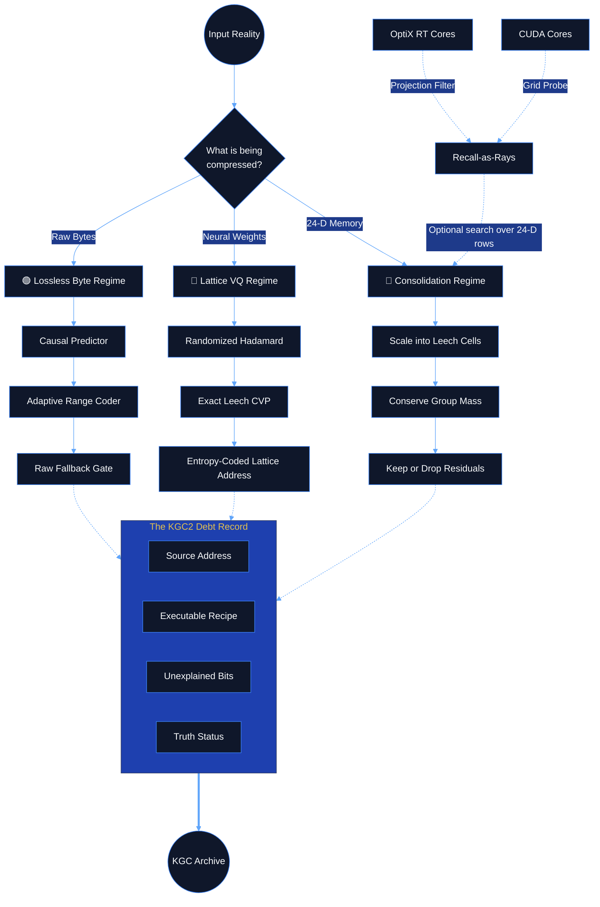

<div align="center">
  
# 🪞 Kaleidoscope Geometric Codec (KGC)

> **A real lattice codec for bytes, tensors, and memory consolidation.**  
> *Compress the model of the thing, then pay precisely for what the model misses.*

[](#experience-the-codec)
[](#-the-philosophy-memory-is-geometry)
[](#1-bytes-the-honest-lossless-path)
[](#2-tensors-lattice-vector-quantization)
[](#-recall-as-rays)

</div>

---

## 🌌 The Philosophy: Memory is Geometry

Compression is often treated as a trick of statistics—a way to squeeze out redundancy so things fit on a smaller disk. KGC treats compression as something entirely different: **a test of understanding**. 

If you truly understand a dataset, you can predict it. If you can predict it, you don't need to store it. What remains—the **residual**—is the part of reality your model failed to capture.

This project is built on a single, uncompromising axiom:

<div align="center">
  
### **The Law of Compression Debt**
$$ L(x) = L(\text{address}) + L(\text{program}) + L(\text{residual}) $$

</div>

An archive must confess where its source came from (the *address*), the deterministic recipe that generated its prediction (the *program*), and the entropy-coded remainder that the recipe could not explain (the *residual*). There are no free bits. No mystical metadata. The decoder inspects the debt before it reconstructs anything.

<p align="center">
  <a href="docs/KGC_ICEBERG.md"><b>🧊 Descend into the Iceberg</b></a> •
  <a href="ARCHITECTURE.md"><b>🏛️ Read the Architecture</b></a>
</p>

---

## 🧭 The Shape of the System

The codec is a living organism that handles three distinct regimes of reality: raw bytes, high-dimensional tensors, and memory consolidation.



| Regime | What it accepts | Core move | Guarantee |
|:---|:---|:---|:---|
| 🟢 **BYTES** | Any byte string | Deterministic prediction + adaptive range coding | Exact recovery; SHA-256 verified; fallback prevents expansion. |
| 🔴 **TENSOR** | Weights or embeddings | Randomized Hadamard, exact Leech quantization | Auditable lossy reconstruction with an explicit rate–distortion dial. |
| 🔵 **CONSOLIDATE** | Sets of 24-D rows | Renormalization collapse to Leech sites | Conserved group mass; optional bitwise-exact residuals. |

---

## 📖 The Story of the Three Regimes

### 1. BYTES: The Honest Lossless Path
For bytes, KGC is a deterministic predictor front-end feeding a carry-less adaptive range coder. The goal is better next-byte probabilities, meaning fewer coded bits. The decoder must regenerate **exactly** the same probability distribution at every byte.

> *KGC is not a replacement for zlib on match-heavy data. Its contribution is a verified debt container and a replayable probabilistic front-end.*

```python
from e8zip import KGCCompressor

kgc = KGCCompressor()
source = b"the residual is the part of reality the model did not catch"

archive = kgc.compress(source)
restored, info = kgc.decompress(archive)

assert restored == source
assert info["truth_status"] == "exact_recovery"
```

### 2. TENSORS: Lattice Vector Quantization
This is where the geometric machinery does the heavy lifting. A tensor is decorrelated, normalized, split into 24-dimensional blocks, and quantized to the nearest point in the **Leech lattice** ($\Lambda_{24}$).

We don't use heuristic nearest-neighbor search. KGC uses an **exact** Conway–Sloane / Golay-code nearest-point decoder. Each 24-D block becomes an efficiently coded lattice address.

> *On our Gaussian-weight benchmark at `scale=4.0`, KGC achieves **4.13 bits/weight at 23.9 dB SNR**, Pareto-dominating scalar INT4 and INT5.*

```python
import numpy as np

weights = np.random.default_rng(7).normal(size=(1024, 768)).astype(np.float32)

archive = kgc.compress_tensor(weights, scale=4.0)
reconstructed, info = kgc.decompress_tensor(archive)

print(info["truth_status"])  # "reconstruction"
```

### 3. CONSOLIDATE: Memory as a Mass-Conserving Field
Consolidation takes a matrix of 24-D rows (embeddings, memory vectors) and performs a renormalization-style collapse. Rows that land in the same scaled Leech cell become one canonical site. When reconstructed, each group is rescaled so its **stored energy is preserved**. 

The graph becomes smaller, but the represented mass does not evaporate.

```python
rows = np.random.default_rng(7).normal(size=(4096, 24)).astype(np.float32)

# Lossy but addressable collapse
archive = kgc.consolidate(rows, rg_scale=0.5, keep_residuals=False)
rows2, info = kgc.deconsolidate(archive)

# Store XOR-exact residuals for bitwise recovery
exact_archive = kgc.consolidate(rows, rg_scale=0.5, keep_residuals=True)
exact_rows, exact_info = kgc.deconsolidate(exact_archive)
```

---

## ⚡ Recall-as-Rays
Retrieving memory from the lattice isn't decompression—it's ray tracing. 

We project 24-dimensional vectors into 3D bounding boxes. Then, using **NVIDIA OptiX RT Cores**, we fire degenerate rays at the memory bank. The hardware naturally answers the question: *which projected regions contain this query?* 

| Backend | Strength | Trade-off |
|:---|:---|:---|
| 🟢 **CUDA Grid Probe** | Low latency at large row counts | Approximate neighborhood filter |
| 🔵 **OptiX BVH** | Exact containment; strongest recall | BVH build overhead |
| 🔴 **Exact GPU GEMM**| Ground truth reference | Does all pairwise work |

---

## ⚖️ The Truth Ladder
Every KGC2 archive reports a truth rung rather than letting every output pretend to be equally literal. The system tells you exactly what kind of reality you are holding:

1. `exact_recovery`: The original bytes were recovered and verified perfectly.
2. `reconstruction`: A declared lossy decoder produced a numeric approximation.
3. `interpretation`: A downstream rendering or summary derived from reconstruction.
4. `confabulation`: A claim has exceeded what the archive can support. 

This distinction is not decorative. It is the boundary that lets a geometric system remain technically honest.

---

## 🚀 Experience the Codec

Dive into the geometry yourself. The core codec is designed to remain useful without a GPU or a local LLM model.

```bash
git clone https://github.com/Howtoimagine/The_Kaleidoscope_Geometric_Compressor.git
cd The_Kaleidoscope_Geometric_Compressor
python -m pip install -e .

# Run the focused v2 upgrade suite
python -m pytest -q tests/test_upgrades.py
```

### 🗺️ The Map
- [`core/kgc.py`](core/kgc.py) — The KGC2 container, debt records, and truth status.
- [`core/entropy.py`](core/entropy.py) — Adaptive models and carry-less range coding.
- [`core/leech_lattice.py`](core/leech_lattice.py) — Exact Leech quantization and theta-series shell counts.
- [`core/rt_optix.py`](core/rt_optix.py) — OptiX BVH traversal with degenerate rays.

---

## 📜 The Final Claim

KGC does not claim that geometry beats every codec on every byte stream. It does not claim that a theta-series prior must improve rate simply because the math is elegant. 

Instead, it makes the only claim a codec should make:

$$ \text{propose model} \;\rightarrow\; \text{encode residual} \;\rightarrow\; \text{decode} \;\rightarrow\; \text{measure} \;\rightarrow\; \text{keep the receipt} $$

The lattice provides a strong discrete geometry; the debt record keeps the system honest; the benchmarks decide what survives.

---
*MIT License — see [`LICENSE.txt`](LICENSE.txt).*
