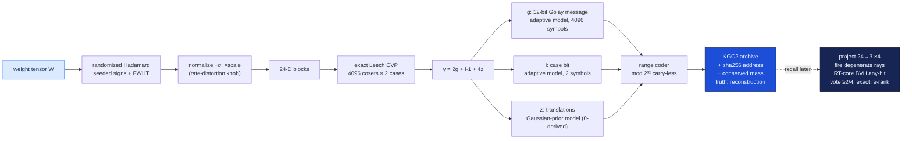

# The KGC Iceberg

Every layer of the Kaleidoscope Geometric Codec, from the pip-installable
surface down to the abyssal mathematics, in the classic iceberg format:
each level is true, each level is implemented in this repository, and
each level is stranger than the one above it. File references and
measured numbers throughout — nothing on this iceberg is aspirational.

**Depth rule:** the deeper you go, the more the system stops looking like
a compressor and starts looking like what it actually is — a memory
system with a conservation law.

```mermaid
flowchart TB

subgraph L0["🌤 SURFACE — what a user sees"]
    direction LR
    A0["pip install e8zip<br/>KGCCompressor()"]
    A1["KGC2 archive blobs<br/>44-byte header + streams"]
    A2["benchmarks that print<br/>the losing baselines too"]
end

subgraph L1["🌊 WATERLINE — the three regimes and the one law"]
    direction LR
    B0["Law of Compression Debt<br/>L(x) = L(address) + L(program) + L(residual)"]
    B1["BYTES regime<br/>lossless, sha256-verified"]
    B2["TENSOR regime<br/>4.13 bits/weight @ 23.9 dB"]
    B3["CONSOLIDATE regime<br/>RG collapse, 0.000% mass drift"]
    B4["truth_status ladder<br/>exact_recovery → confabulation"]
end

subgraph L2["🐟 SHALLOWS — the entropy spine"]
    direction LR
    C0["carry-less range coder<br/>mod 2^32, Subbotin style"]
    C1["adaptive Fenwick-tree models<br/>O(log n) encode/decode"]
    C2["prior-seeded models<br/>raised rescale ceiling"]
    C3["randomized Hadamard transform<br/>QuIP#-style incoherence"]
    C4["honest raw fallback<br/>random data never expands"]
end

subgraph L3["🦑 MID-DEPTH — the geometric machinery"]
    direction LR
    D0["Golay [24,12,8] code<br/>Pless syndrome decoder"]
    D1["exact Leech CVP<br/>4096 cosets × 2 cases, vectorized"]
    D2["bijective index decomposition<br/>y = 2g + i·1 + 4z"]
    D3["self-healing indices<br/>3 bit flips repaired"]
    D4["conserved-mass reconstruction<br/>XOR-exact IEEE-754 residuals"]
end

subgraph L4["🌑 DEEP — the theta stratum"]
    direction LR
    E0["exact theta series<br/>Θ = E₁₂ − (65520/691)Δ"]
    E1["pentagonal number theorem<br/>integer-exact Δ expansion"]
    E2["Ramanujan congruence<br/>τ(n) ≡ σ₁₁(n) mod 691"]
    E3["Gaussian z prior<br/>WON: 4.20 → 4.13 bpw, free"]
    E4["shell-indexed coding<br/>LOST: +0.24 bpw, kept & documented"]
end

subgraph L5["🕳 ABYSS — compression is prediction"]
    direction LR
    F0["predictor socket<br/>any causal model drives the coder"]
    F1["gru-online<br/>trains during encode AND decode"]
    F2["model as program, not payload<br/>no weights in the archive"]
    F3["E8-trajectory context<br/>the data's path IS the context"]
end

subgraph L6["⚫ HADAL — recall-as-rays and the lineage"]
    direction LR
    G0["memory recall on RT cores<br/>degenerate rays, any-hit shaders"]
    G1["24 = 8 × 3<br/>Leech splits into ray-sized subspaces"]
    G2["Glass Network KMind<br/>Law 9, consolidation ticks"]
    G3["the codec is a memory system<br/>archives are consolidated memories"]
end

A0 --> B0
A1 --> B0
A2 --> B4
B1 --> C0
B2 --> C3
B3 --> D4
B0 --> B4
C0 --> C1 --> C2
C3 --> D1
C4 --> C0
D0 --> D1 --> D2
D2 --> C1
D0 --> D3
D4 --> D2
E0 --> E1
E0 --> E2
E0 --> E4
E3 --> C2
E4 --> C2
D1 --> E0
F0 --> C0
F1 --> F2
F0 --> F1
F3 --> C1
G0 --> G1
D2 --> G0
G2 --> B0
G2 --> B3
G3 --> G2
B3 --> G3

classDef surface fill:#dbeafe,stroke:#3b82f6,color:#1e3a5f
classDef water fill:#bfdbfe,stroke:#2563eb,color:#1e3a5f
classDef shallow fill:#93c5fd,stroke:#1d4ed8,color:#172554
classDef mid fill:#60a5fa,stroke:#1e40af,color:#0f172a
classDef deep fill:#3b82f6,stroke:#1e3a8a,color:#f8fafc
classDef abyss fill:#1d4ed8,stroke:#172554,color:#f8fafc
classDef hadal fill:#172554,stroke:#020617,color:#f8fafc

class A0,A1,A2 surface
class B0,B1,B2,B3,B4 water
class C0,C1,C2,C3,C4 shallow
class D0,D1,D2,D3,D4 mid
class E0,E1,E2,E3,E4 deep
class F0,F1,F2,F3 abyss
class G0,G1,G2,G3 hadal
```



---

## 🌤 Level 0 — Surface: what a user sees

**"It's a compression library."**

- `pip install -e .`, `from e8zip import KGCCompressor`, three methods:
  `compress`, `compress_tensor`, `consolidate` (plus their inverses and
  `inspect`). One class, one container format ([core/kgc.py](../core/kgc.py)).
- Every `KGC2` archive starts with a 44-byte header: magic `KGC2`,
  version, regime, truth_status, a flags byte, source length, a 32-byte
  sha256, conserved mass, member count (`HEADER_SIZE = 60` with the
  mass/member fields). `inspect()` reads the debt record without
  decoding a single payload byte.
- The benchmarks print the baselines that beat us
  (`benchmarks/benchmark_kgc.py`: "zlib printed because it wins on
  match-heavy data"). This is policy, not an accident — see Level 4.

## 🌊 Level 1 — Waterline: three regimes, one law

**"Wait, every archive is a *debt*?"**

The unifying object is the **Compression Debt triple** (Glass Network
KMind, Law 9 — see Level 6):

```
L(x) = L(address) + L(program) + L(residual)
address  = sha256 of source + conserved mass + member ids
program  = codec id, lattice, seeds — an executable recipe, not stored bytes
residual = range-coded bits the geometric prior could not predict
```

- **BYTES** ([kgc.py](../core/kgc.py) `compress_bytes`): lossless,
  decode re-hashes and *raises* on mismatch. Program byte selects
  order-1 / order-2 / E8-geometric / predictor models.
- **TENSOR** (`compress_tensor`): QuIP#-family weight compression.
  Measured 4.13 bits/weight @ 23.9 dB SNR — Pareto-dominates scalar
  INT4 (4.0 bpw @ 15.8 dB) and INT5 (5.0 bpw @ 22.0 dB).
- **CONSOLIDATE** (`consolidate`): rows collapse onto shared lattice
  sites — up to 8.3× with 0.000% conserved-mass drift, or bitwise-exact
  with residuals kept.
- Lossy compression **without source addresses raises `Law9Error`**.
  The exception message is the law's own words: *"compression lacks
  source addresses."*
- Every decode reports a **truth_status** rung borrowed from the KMind
  language decoder: `exact_recovery` (0) → `reconstruction` (1) →
  `interpretation` (2) → `confabulation` (3). The codec tells you which
  rung you're standing on; it never pretends.

## 🐟 Level 2 — Shallows: the entropy spine

**"There's no zlib in the hot path. Everything ends at one range coder."**

- [core/entropy.py](../core/entropy.py): a carry-less Subbotin-style
  range coder — 32-bit range, byte-wise renormalization, and the trick
  that all arithmetic is **deliberately mod 2³²**: intentional wraparound
  replaces carry propagation (`self.low = (self.low + r * cum) &
  MASK32`). The underflow fix is one line: `range_ = (-low) & (BOT-1)`.
- `AdaptiveModel` keeps symbol frequencies in a **Fenwick (binary
  indexed) tree**, so encode/decode stay O(log n) even for the 4096-way
  Golay coset alphabet. Rescaling halves counts at a ceiling — which
  bounds the worst-case cost of a never-seen symbol and is *why random
  data stays ~8 bits/byte instead of expanding*.
- v2.1: models accept an initial **prior** with a raised rescale
  ceiling (32768 vs 4096) — finer prior resolution, and the data still
  overrides it through rescaling. This is the delivery mechanism for
  the theta stratum (Level 4).
- The tensor path first applies a **randomized Hadamard transform**
  (seeded sign flips + FWHT): the QuIP# incoherence pass that makes
  weight blocks look Gaussian so the lattice quantizer meets its design
  distribution.
- The **honest fallback**: if the model's output is not smaller than
  the input, the archive stores raw bytes (`PROG_RAW`). Never expands,
  never bluffs.

## 🦑 Level 3 — Mid-depth: the geometric machinery

**"The quantizer is exact, and its indices can heal themselves."**

- [core/golay.py](../core/golay.py): the [24,12,8] extended binary
  Golay code, systematic `G = [I | B]` with B from the bordered
  quadratic-residue-11 construction, decoded by **Pless arithmetic
  syndrome decoding** — up to 3 bit errors corrected, 4 detected. The
  weight enumerator (1, 759, 2576, 759, 1) is a unit test.
- [core/leech_lattice.py](../core/leech_lattice.py): **exact** nearest-
  point search in the Leech lattice Λ₂₄ via Conway–Sloane Construction
  A — for each of the 4096 Golay codewords × 2 coset cases, the nearest
  congruent integer vector, with a parity-repair step that swaps one
  coordinate to its next-nearest representative. Fully vectorized: the
  distance-to-every-coset computation is a single `(N,24) @ (24,4096)`
  matmul. Verified optimal against exhaustive coset search.
- The **index decomposition** is what makes the lattice codeable:
  every scaled Leech point is uniquely `y = 2g + i·1 + 4z` with `g` one
  of 4096 Golay codewords, `i ∈ {0,1}`, `z ∈ Z²⁴`. Three streams —
  12-bit message, 1 case bit, small integers — each with its own
  adaptive model. (This also fixed the upstream KMind
  `turbo_leech_packer` arity bug: it *expected* this decomposition; the
  old decoder never returned it.)
- **Self-healing archives**: the 12-bit Golay message expands to a
  24-bit codeword, so `LeechCodec.heal_index` repairs any stored index
  with ≤3 flipped bits. The error-correcting code and the quantizer are
  *the same object* — that's the Leech lattice's whole personality.
- **Conserved mass** ([kgc.py](../core/kgc.py) `_mass_scaled_recon`):
  consolidation stores per-site energy and reconstruction rescales each
  site so its group's energy matches exactly — the KMind's
  foreground-mass conservation as a file format. Bitwise-exact mode
  stores **XOR-of-IEEE-754-payloads** residuals: immune to double
  rounding, and near-zero residuals have mostly-zero high bytes.

## 🌑 Level 4 — Deep: the theta stratum

**"The codec computes a modular form to decide its priors — and one of
the two priors it derives is a documented failure."**

- The Leech theta series counts lattice points per shell:
  `Θ_Λ = E₁₂ − (65520/691)·Δ`, coefficients (1, 0, 196560, 16773120,
  398034000, …). [leech_lattice.py](../core/leech_lattice.py)
  `theta_series(n)` computes N(2n) for **arbitrary** n in exact integer
  arithmetic: Δ's Euler product `q·∏(1−qᵐ)²⁴` expanded via the
  **pentagonal number theorem**, raised to the 24th power by
  squaring, plus a σ₁₁ divisor sieve.
- Integrality of `65520·(σ₁₁(n) − τ(n))/691` is equivalent to the
  **Ramanujan congruence** `τ(n) ≡ σ₁₁(n) mod 691` — the code checks
  the division and raises `ArithmeticError` if number theory ever
  breaks. A unit test rides on a 90-year-old theorem.
- **The prior that won:** for a Gaussian source at per-coordinate std
  `scale`, the z-translations are approximately Gaussian with
  σ_z = scale·√8/4. Seeding the z model with that discretized Gaussian
  costs zero side information and saves ~1.5 bits/block of adaptation
  warm-up: **4.20 → 4.13 bits/weight at identical 23.9 dB**. Default on
  (`FLAG_Z_PRIOR` in the header flags byte; 2.0 archives still decode).
- **The prior that lost:** shell-indexed coding — encode each block's
  shell against the max-entropy prior P(shell n) ∝ N(2n)·e^(−n/scale²)
  (which peaks at shell ≈ 11·scale², exactly where theory says), then
  condition z on shell. But the shell is a *deterministic function* of
  (g, i, z): `H(shell) + H(g,i,z|shell) = H(g,i,z)`, so explicit shell
  coding can at best break even, and measured it costs ~8 bits/block
  while conditioning recovers only ~2: **net +0.24 bpw**. It is kept,
  opt-in, documented as a loss (progressive decode and shell auditing
  are its remaining uses). The falsified hypothesis is part of the
  architecture record — that's the falsification-first policy from
  Level 0 going all the way down.

## 🕳 Level 5 — Abyss: compression is prediction

**"The decompressor trains a neural network. The same one the compressor
trained. That's why it works."**

- [core/predictor.py](../core/predictor.py): the BYTES regime's model
  slot is a *socket* — anything with `reset() / predict() → 256 probs /
  update(byte)` drives the range coder through `PredictorByteModel`,
  which deterministically quantizes each pmf to integer frequencies
  (every symbol keeps freq ≥ 1: a confidently wrong model can't make a
  byte uncodeable).
- **`gru-online`**: an NNCP-style byte-level GRU that trains **during
  both compression and decompression** from a fixed seed. No weights
  ride in the archive — encoder and decoder take identical gradient
  steps as bytes stream through, so their probability streams match
  bit-for-bit. This is Law 9's "program, not payload" taken literally:
  the model is *re-derived*, not stored. Measured: 2.68× on 8 KB of
  source (learning from scratch), vs ngram-mix 2.87× and order-2 2.28×.
- The determinism contract is enforced by the debt: any encoder/decoder
  drift desynchronizes the range coder and the sha256 check **fails
  loudly** instead of returning silently wrong bytes.
- `CallablePredictor` adapts any external logits function (torch,
  llama.cpp, ONNX) with a byte-history window — the socket a pretrained
  byte-LLM plugs into. Archives store only the predictor's registry
  *name*; both sides must have it registered.
- Deeper still: `GeometricContextModel` ([entropy.py](../core/entropy.py))
  — the context id for the next byte is the **E8 lattice site of the
  recent byte-window's trajectory**. Encoder and decoder replay the
  identical trajectory, so the geometry is regenerated, never stored.
  The data's path through E8 space *is* the context state.

## ⚫ Level 6 — Hadal: recall-as-rays, and what this thing actually is

**"The memory bank is queried by firing rays at it on ray-tracing
hardware. And the compressor was never really a compressor."**

- [core/rt_optix.py](../core/rt_optix.py): k-NN recall over stored 24-D
  rows runs on **NVIDIA RT cores**. Stored rows are projected 24→3
  (four seeded orthonormal projections, scaled √(24/3)); each projection
  becomes a BVH of per-row bounding boxes; each query fires a
  **degenerate ray** (tmin=0, tmax=10⁻¹⁶ — a containment test, not a
  ray) whose custom `__intersection__` tests origin-in-sphere and whose
  `__anyhit__` atomically appends `(query_id, row_id)` and calls
  `optixIgnoreIntersection()` so traversal visits *every* overlapping
  box. Survivors of a ≥2-of-4 projection vote get exact 24-D re-rank.
  The device programs are NVRTC-compiled at first use; the OptiX
  runtime ships inside the GeForce driver.
- Measured (RTX 3070 Ti): at a saturating batch the RT path is the
  **fastest method (0.009 ms/query)** and the only one at
  **recall@10 = 1.000** (BVH containment is exact; the CUDA grid probe
  only inspects 27 neighbor cells). At N=2M the tuned CUDA probe wins
  latency on this Ampere card — an honest split verdict, in
  [RT_RECALL.md](RT_RECALL.md), matching the literature's caveat that a
  strong CUDA baseline is hard to beat (JUNO, ASPLOS 2024, is the
  relevant prior art).
- A numerological coincidence that is also an engineering fact:
  **24 = 8 × 3**. The Leech dimension splits exactly into
  ray-tracing-sized 3-D subspaces (and into three E8 layers —
  `LeechLattice.project_to_e8` exposes them). The lattice that solved
  sphere packing happens to factor into the shape of GPU ray hardware.
- **The lineage**: every deep structure here is ported from the Glass
  Network KMind (glass_windows branch) — `golay.py`, `leech.py`, the
  conserved-mass consolidation tick, `law_registry.py`. Law 9
  ("compression requires source addresses and an executable program")
  was a *memory law* before it was a file format: the KMind consolidates
  memories by collapsing them onto lattice sites while conserving their
  mass, and refuses to forget without keeping an address back to what
  was forgotten.
- Which is the bottom of the iceberg: **KGC is the KMind's memory
  consolidation implemented as an archive format.** BYTES is verbatim
  memory with a verified address. TENSOR is semantic memory quantized
  onto the densest possible geometry. CONSOLIDATE is sleep — the RG
  collapse of many experiences onto shared archetypes, mass conserved,
  members addressable, truth status declared. And recall-as-rays is
  retrieval: you don't decompress a memory, you *fire a query at the
  lattice and see what lights up*. The truth_status ladder — recovery,
  reconstruction, interpretation, confabulation — is not compression
  jargon. It's the honest epistemology of remembering.

---

## Cross-section: one tensor's journey to the bottom



*Every claim above has a test in `tests/` (73 passing, including live
RT-core tests) or a reproducible benchmark in `benchmarks/`. The
falsified ideas are labeled as falsified. That is the whole method.*
